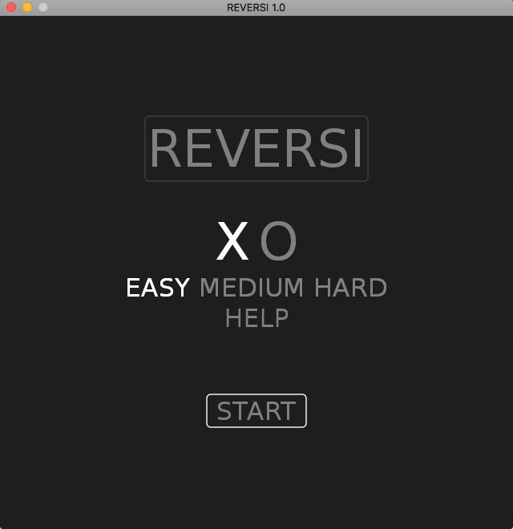
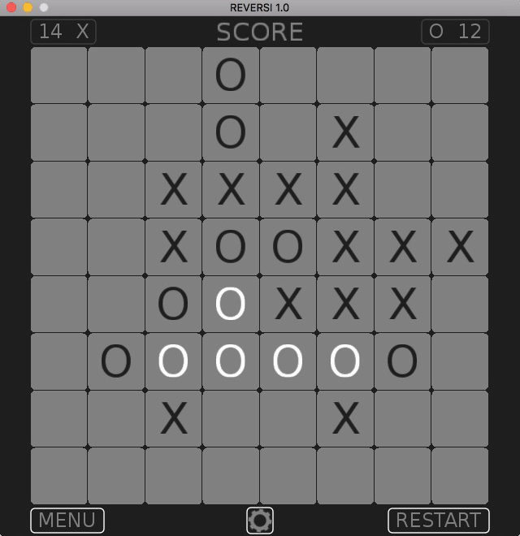
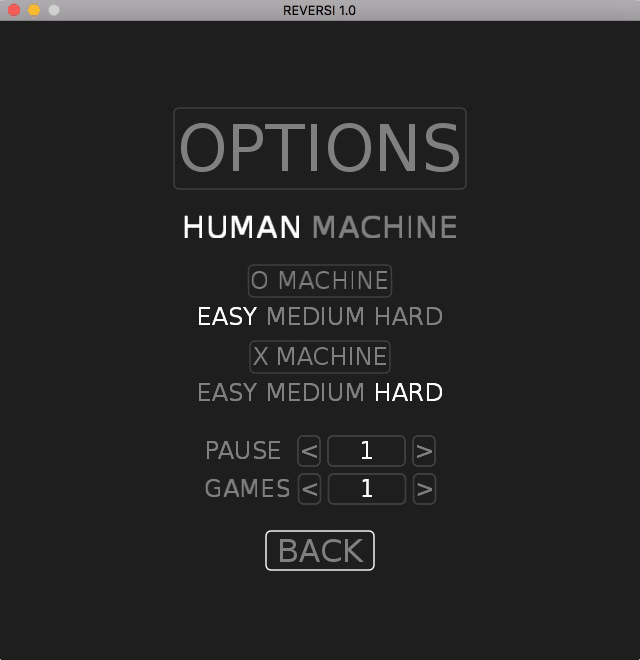

# Reversi

v3.0

"Reversi" is a strategy board game for two players, played on an 8×8 uncheckered board.

HINT: Click help in main menu and app show you available moves when you start playing.

Made with Love2d and simple self-made GUI library on top of Love Engine.

[Release available for Mac OS 64-bit & for Windows 32-bit](https://github.com/schwarzbox/Reversi/releases)

To run source code: clone repository, download & install [LÖVE 11.3](https://love2d.org) for you system and run reversi.love

