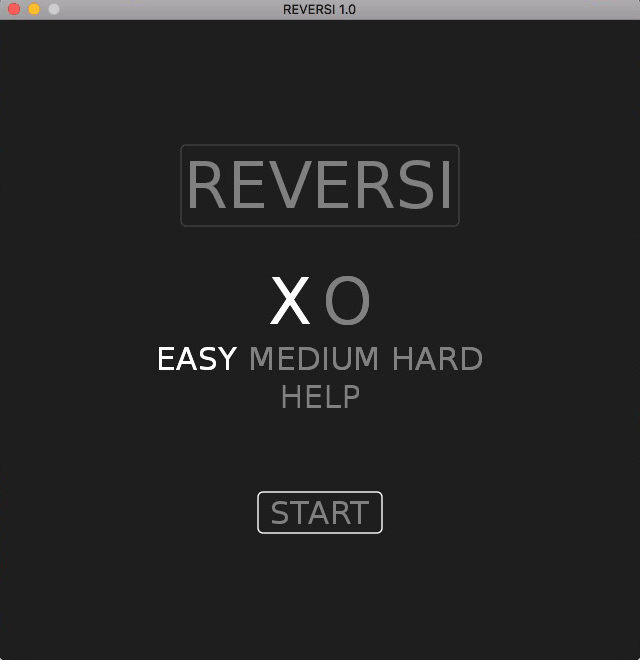
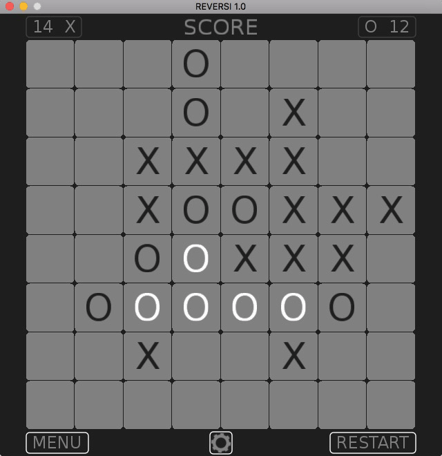
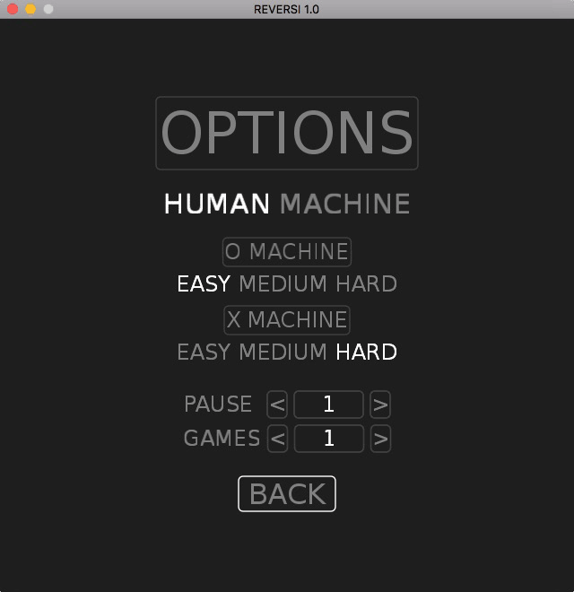

# Reversi

## v3.1

Classic two-player strategy board game played on an 8×8 board.

Capture and flip your opponent's pieces to control the majority of the board.

### Controls

| Place | Exit |
|:-----:|:----:|
| **LMB** | **Esc** |

### Credits

Design/Art/Code: [Aliaksandr Veledzimovich](https://twitter.com/veledzimovich) 
Engine: [LÖVE](https://love2d.org/) [License](https://github.com/love2d/love/blob/main/license.txt) 

